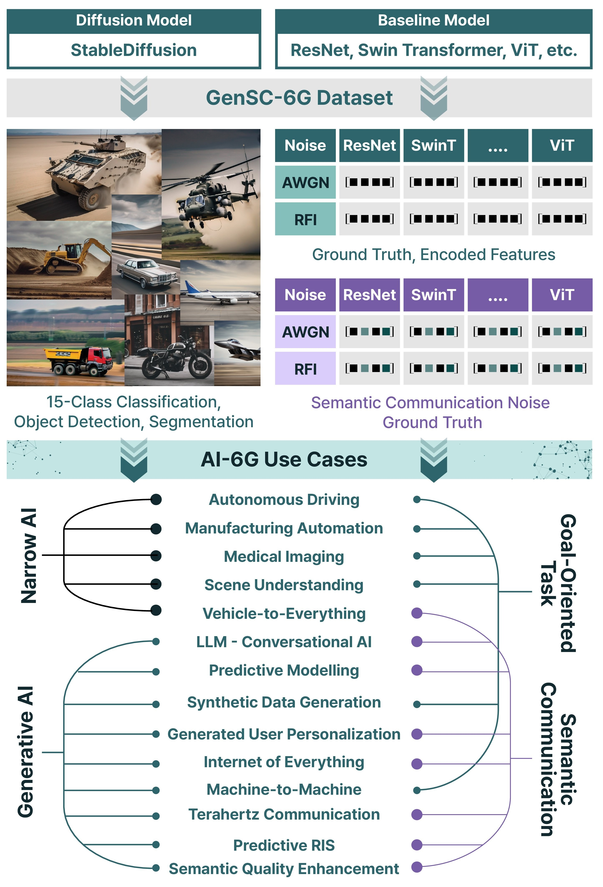
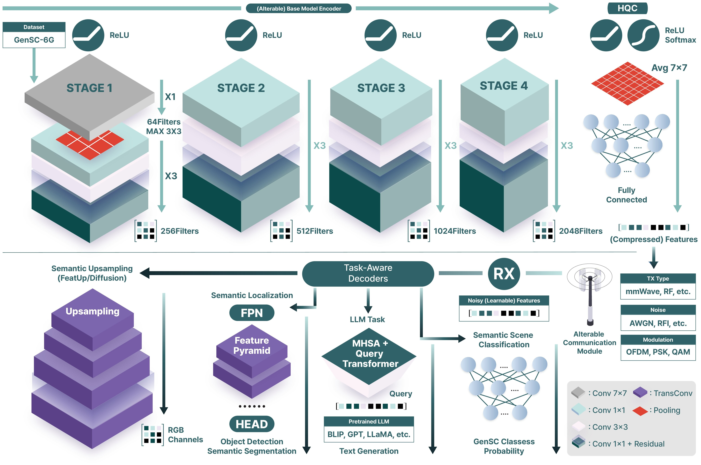

# GenSC-6G - Scalable Semantic Communication Framework and Dataset

This repository contains the **first semantic communication dataset and playground**, designed to be scalable, reproducible, and adaptable for a wide range of applications. The dataset and framework are tailored for semantic decoding, classification, and localization tasks in 6G applications, integrating generative AI and semantic communication. Implementation of **[GenSC-6G: A Prototype Testbed for Integrated Generative AI, Quantum, and Semantic Communication](https://arxiv.org/abs/2501.09918)**.

---

## Features of the GenSC-6G Dataset

### 🔧 Adaptable SC Framework
A flexible prototype that supports modifications to baseline models, communication modules, and decoders, enabling customization for diverse communication needs.

### 🤖 Generative AI-Driven SC
The integration of generative AI for synthetic data generation, enriching the Knowledge Base (KB) and leveraging large language model (LLM) capabilities for enhanced semantic tasks.

### 📊 Noise-Augmented Dataset
A labeled dataset with injected noise, specifically optimized for semantic tasks such as target recognition, localization, and recovery. The dataset comprises 4,829 training and 1,320 testing instances across 15 classes of military and civilian vehicle types. It incorporates Additive White Gaussian Noise (AWGN) and Radio Frequency (RF) interference at varying Signal-to-Noise Ratios (SNRs) to evaluate model robustness under realistic channel conditions.

### 📥 Dataset Download and Overview

#### Main Dataset
**[Download the main dataset here](https://huggingface.co/datasets/CQILAB/GenSC-6G)**

#### Segmentation Dataset
**[Download the segmentation dataset here](https://huggingface.co/datasets/CQILAB/GenSC-6G-Segmentation)**

### 📝 Case Study on Semantic Tasks
A detailed case study that evaluates baseline models across various semantic tasks, assessing performance and adaptability under different noise conditions to validate the GenSC-6G framework.

<p align="center">
  
  
</p>

---

## Table of Supported Case Study

<table>
  <tr>
    <th>Classification Models</th>
    <th>Segmentation Models</th>
    <th>Upsampling Models</th>
    <th>EdgeLLM Models</th>
  </tr>
  <tr>
    <td>ClassicalViT-L-32</td>
    <td>UNet</td>
    <td>ResNet-50</td>
    <td>Llama-3</td>
  </tr>
  <tr>
    <td>ViT-L-32</td>
    <td>EfficientNet</td>
    <td>DINO-V2</td>
    <td>BLIP-2</td>
  </tr>
  <tr>
    <td>ResNet-50</td>
    <td>SAM</td>
    <td>ViT-L-32</td>
    <td>GPT-4</td>
  </tr>
  <tr>
    <td>VGG-16</td>
    <td></td>
    <td></td>
    <td>Qwen2-VL</td>
  </tr>
  <tr>
    <td>Inception-V3</td>
    <td></td>
    <td></td>
    <td>Phi3-Vision</td>
  </tr>
  <tr>
    <td>EfficientNet-B1</td>
    <td></td>
    <td></td>
    <td></td>
  </tr>
  <tr>
    <td>MobileNet-V3</td>
    <td></td>
    <td></td>
    <td></td>
  </tr>
</table>

---

## Setup Instructions

### 1. Environment Setup
- Install [Anaconda](https://www.anaconda.com/products/distribution).
- Create an environment using:
  ```bash
  conda env create -f environment.yml  # For classical-only setup
  conda env create -f environment-quantum.yml  # For HQC setup
  conda activate gensc
  ```

### 2. Dataset Setup
- Download the dataset from [HuggingFace🤗](https://huggingface.co/datasets/CQILAB/GenSC-6G):
  ```bash
  cd GenSC-Testbed
  git clone https://huggingface.co/datasets/CQILAB/GenSC-6G
  cd ..
  ```

### 3. Training Scripts
- For classification tasks:
  ```bash
  python train.py  # For quantum-based training
  python train-nonquantum.py  # For classical training
  ```
- For upsampling tasks:
  ```bash
  python train_super_res.py
  ```
#### Example of Running Experiments
- Train-test  different models classification ([inceptionv3, resnet, qresnet, vit, swin, mobilenet, efficientnet, vgg, qcnn]) using:
  ```bash
  python train.py --model_name resnet --batch_size 32 --snr 10
  ```
  ```bash
  python train_nonquantum.py --model_name resnet --batch_size 32 --snr 10
  ```
- Train-test different models upsampling with:
  ```bash
  python train_super_res.py --model_name resnet --batch_size 32 --snr 10
  ```

#### For Interactive Examples
  - `playground-training-classification.ipynb`
  - `playground-training-upsampling-and-edgellm.ipynb`

  **Set the kernel to `gensc`**.

---

## Code Customization

- **Encoders and Decoders**:
  - Modify `allmodels.py` to use custom encoder networks.
  - Pair with decoders defined in `decoder.py`.

- **Edge LLM Models**:
  - Replace the edge-based large language model (LLM) with alternatives in `playground-training-upsampling-and-edgellm.ipynb`.

---

## Reproducibility

### 🗃️ Dataset 
Labeled dataset with ground-truth data, noise features, and extracted semantic features. Uploaded to **[HuggingFace🤗](https://huggingface.co/datasets/CQILAB/GenSC-6G)**
#### Dataset Columns and Descriptions
- **image**: Raw image data used for training and evaluation.
- **image_path**: Path to the corresponding image file.
- **classification_class**: Integer label corresponding to the classification category (0-15).
- **classification_{basemodel}_features**: Extracted feature embeddings from `{basemodel}`'s encoder, consisting of 1000 float32 tensors.
- **classification_awgn10dB_{basemodel}_features**: Feature embeddings extracted from `{basemodel}` encoder with Additive White Gaussian Noise (AWGN) at 10dB SNR.
- **classification_awgn30dB_{basemodel}_features**: Feature embeddings extracted from `{basemodel}` encoder with AWGN at 30dB SNR.
- **upsampling_{basemodel}_features**: Extracted feature embeddings for upsampling tasks using `{basemodel}` encoder, consisting of 1000 float32 tensors.
- **upsampling_awgn10dB_{basemodel}_features**: Upsampling features with AWGN at 10dB SNR for `{basemodel}`.
- **upsampling_awgn30dB_{basemodel}_features**: Upsampling features with AWGN at 30dB SNR for `{basemodel}`.

### 🏗️ Testbed
To experiment with real-world semantic communication, you can use the **GNURadio and HackRF**.
1. **Install Dependencies**:
   - Install [GNU Radio](https://www.gnuradio.org/)
   - Install HackRF tools: `sudo apt install hackrf`
2. **Configure Transceiver**:
   - Transmitter config: `GNURadio/transmitter.grc`
   - Outputs a **streaming binary file**
3. **Run Transmitter**:
   - Open `GNURadio/transmitter.grc` in GNU Radio Companion
   - Set SDR parameters (frequency, gain, bandwidth)
   - Execute to start transmission
4. **Run Receiver**:
   - Modify `GNURadio/receiver.grc` settings
   - Run to capture and process signals
By following these steps, you can replicate real-world transmission experiments using the testbed and analyze its performance.


### 💻 Flexible Code  
Modular structure for customization, including:
  - Base models
  - Communication modules
  - Decoders
  - Base model and decoder that is task awareness and potentially support more AI downstream task.
  
### 📊 Performance Metrics
- The model outputs logs in `logs/` directory.
- Metrics include:
  - **Accuracy**
  - **F1 Score**
  - **PSNR (Peak Signal-to-Noise Ratio)**
  - **SSIM (Structural Similarity Index Measure)**
  - **LPIPS (Learned Perceptual Image Patch Similarity)**
  - **CLIP-S (Contrastive Language-Image Pretraining Score for LLMs)**
  - **BERT Score**
  - **BLEU Score**
  - **Word Error Rate (WER)**

  These metrics provide insight into the robustness of models under different noise conditions and evaluate text-image alignment for semantic tasks. For additional evaluation metrics, refer to [TorchMetrics](https://lightning.ai/docs/torchmetrics/stable/all-metrics.html).

### 🔄 Model Checkpoints
- Trained models are saved in the `logs/` directory. (Can be opened with tensorboard)
- Checkpoints can be loaded for continued training or evaluation.

---

## Citation
The paper can be found at [arXiv](https://arxiv.org/abs/2501.09918).

If you use this dataset or framework in your research, please cite:

```bibtex
@article{gensc6g,
      title={GenSC-6G: A Prototype Testbed for Integrated Generative AI, Quantum, and Semantic Communication}, 
      author={Brian E. Arfeto and Shehbaz Tariq and Uman Khalid and Trung Q. Duong and Hyundong Shin},
      year={2025},
      eprint={2501.09918},
      archivePrefix={arXiv},
      primaryClass={cs.AI},
      url={https://arxiv.org/abs/2501.09918}, 
}
```

---

## Others

- Official Repository: [CQILAB/GenSC-6G](https://github.com/CQILAB-Official/GenSC-6G)
- Dataset: [HuggingFace](https://huggingface.co/datasets/CQILAB/GenSC-6G)

## License
```
MIT License
```

## Contributor
- Brian Estadimas
- Shehbaz Tariq

You can contribute by adding your own model or modifying the code. Make a pull request (PR), and once it is merged, your name will be listed here.

## Changelogs
- Dataset uploaded to HuggingFace and Repo intiated